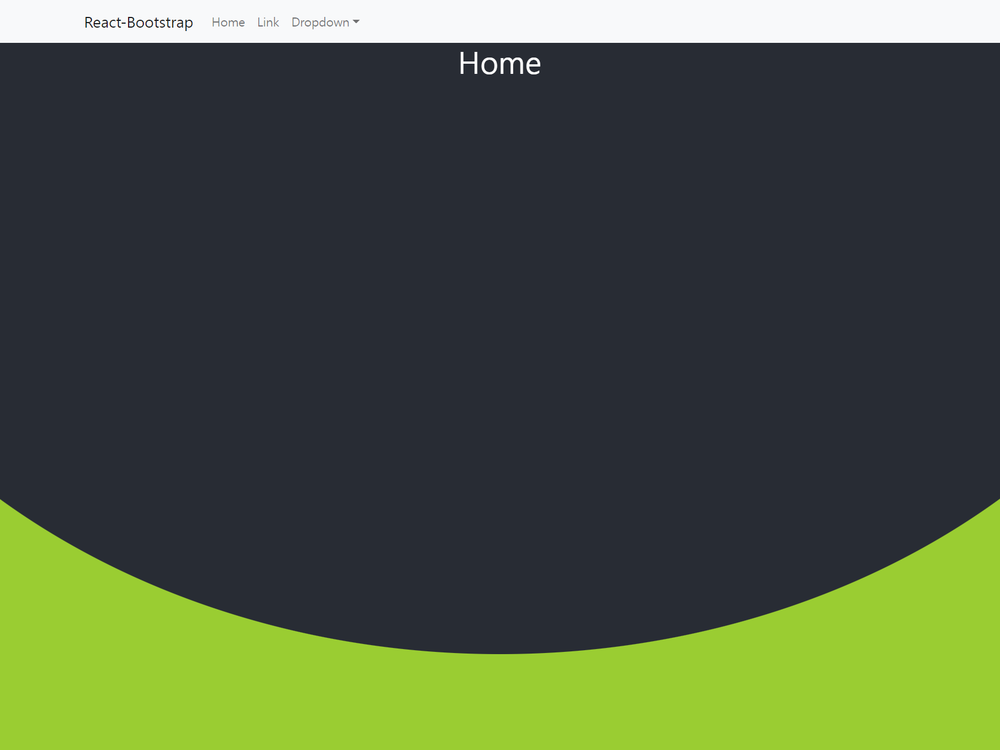

# React-BootStrap 과 React-Router-Dom, Styled-Component 연동

부트스트랩의 주요 속성들과 리엑트 라우터 돔, 스타일드 컴포넌트를 활용해서 메인페이지 구성하는 예제. 

부트스트랩과 리액트 라우터 돔을 연동할때, 버전 이슈로 꽤 힘들었는데, 아래 링크를 보고 따라하면서 해결이 잘 되었다. 

- [(312) React JS 부트스트랩 네비게이션 & 커브 헤더 컴포넌트 만들어보기! #react #부트스트랩 #컴포넌트 - YouTube](https://www.youtube.com/watch?v=Zwie79F3-lo)

페이지 말고 부트스트랩 테마를 따로 적용해야 하는데, 테마를 적용하고 나서도, 그 중 메인 페이지는 이번에 작성한 페이지를 사용할까 고민을 잠깐했다ㅋㅋ 

이번 주부터 코딩테스트를 본격적으로 준비 중인데, 잠깐 20분씩 짬내서 이런것들 정리해두면 마음이 편할것 같아서 내친김에 라우터, 부트스트랩, 스타일 컴포넌트 예제를 따라하면서 연습 & 메모 완료. 

메모장에 내용을 필기했다. 메모장에 필기한 내용은 따로 다듬어서 stock-cells-kr 에 정리해둬야 겠다. 

 

내일 중으로는 트랜잭션 관련해서 커밋롤백 원칙, 프록시 원칙 등을 노션에 정리해둔게 있는데 그것을 정리를 하면서 천천히 올리지 않을까 싶다. 

어차피 코테 풀다가 빡구현 문제는 아이디어를 떠올리기 고통스러울때가 있는데, 이럴 때마다 20분씩 시간내서 이것 저것 정리해둬야지. 

 

아래는 잠깐 적용해봤던 페이지의 스샷\~\~\~\~

